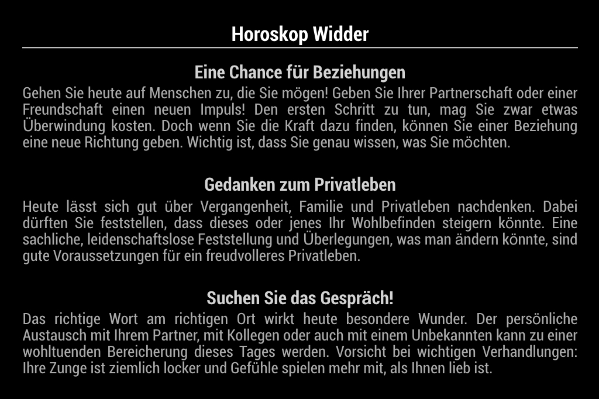

# MMM-Horoscope
This an extension for the [MagicMirror²](https://magicmirror.builders/).
<br>This Module is used to show your daily horoscope on your Magic Mirror.
<br>Content is pulled from German website, so the text is in German language.

## What does it look like


## General information
The content is pulled from [SAT.1 Horoscope page](https://www.sat1.de/ratgeber/horoskop/tageshoroskop).
It's no API, you don't need a key, there is no limitation and it's free of charge.

## Dependencies
  * An installation of [MagicMirror<sup>2</sup>](https://github.com/MichMich/MagicMirror)

## Installation
1. In your terminal, navigate to your MagicMirror's Module folder:
````
cd ~/MagicMirror/modules
````

2. Clone this GIT repository:
````
git clone https://github.com/bernhardweyrauch/MMM-Horoscope.git
````

3. Install required node modules
````
cd MMM-Horoscope
npm install
````

## Using the module
To use this module, add it to the modules array in the `config/config.js` file:
````javascript
modules: [
    {
        module: 'MMM-Horoscope',
        position: 'upper_third',
        config: {
            // See 'Configuration options' for more information.
            ...
        }
    }
]
````
If you declare several modules in the `config/config.js` file, you will get several memo notes on your MagicMirror<sup>2</sup> profile.

## Configuration options
The following properties can be configured:

| Option                     | Description
| -------------------------- | -----------
| `title`                | [OPTIONAL]<br>Title of the horoscope.<br>Can be empty and will be hidden then.
| `sign`                 | [MANDATORY]<br>Valid option of your sign. Following values are allowed: steinbock, wassermann, fische, widder, stier, zwillinge, krebs, loewe, jungfrau, waage, skorpion, schuetze<br><br> **Default value:** `widder`
| `refreshInterval`                | [OPTIONAL]<br>Refresh interval in seconds.<br><br> **Default value:** `14400` (4 hours)


## Update
To update the module, just pull the latest state from GitHub, and refresh node modules
````
cd ~/MagicMirror/modules/MMM-Horoscope
git pull
npm install
````
